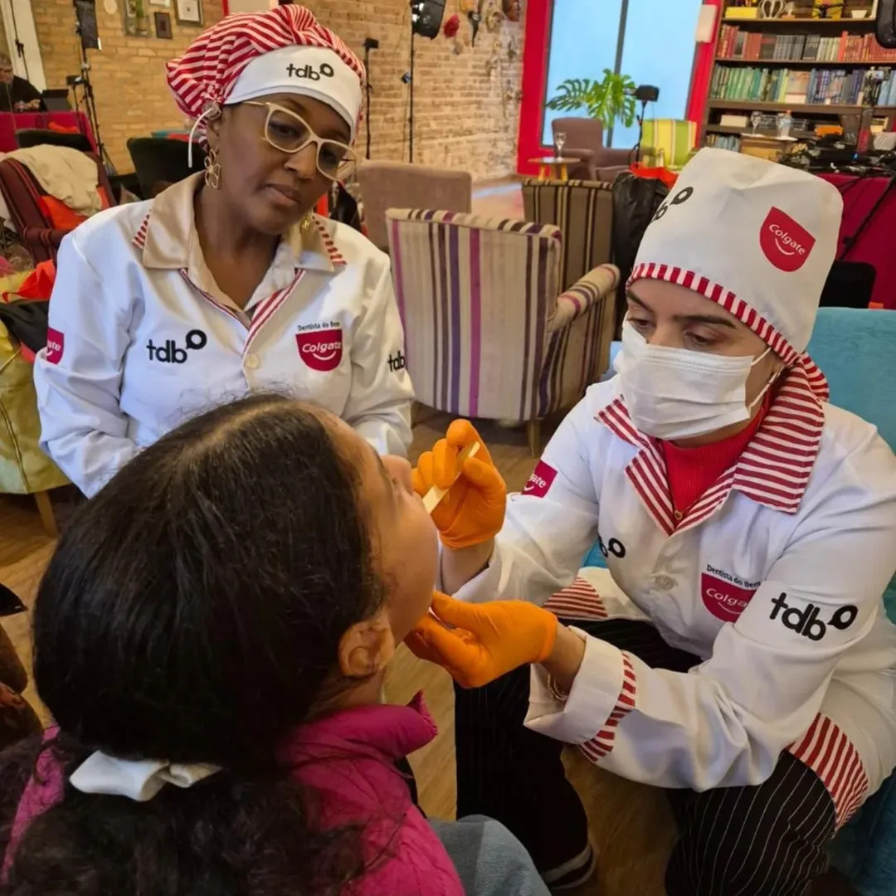
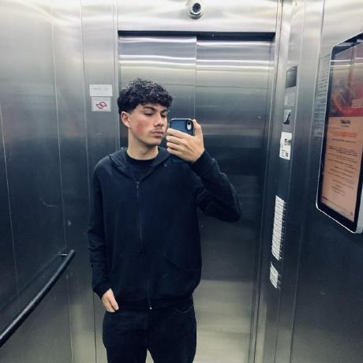

# Turma do Bem - Plataforma de apoio

Projeto acadêmico da turma **1TDSPA**, desenvolvido para a Sprint 1 de Front-End Design Engineering da FIAP.

O site apresenta a Turma do Bem e uma proposta para aproximar a ONG de pessoas e empresas que querem ajudar. O visitante pode conhecer resultados, consultar necessidades e preencher uma oferta de apoio.


## Proposta

O desafio é centralizar informações, gerenciar doadores e parceiros, automatizar processos e utilizar dados e Inteligência Artificial para apoiar decisões.

Nossa proposta combina uma área pública de captação com uma futura área interna de gestão:

- **Área pública:** apresenta histórias, resultados e colaboradores, mostra necessidades e recebe ofertas de materiais, serviços, divulgação ou apoio financeiro.
- **Área interna, prevista para etapas futuras:** reúne os dados dos apoiadores e o histórico das ofertas, organiza contatos e tarefas e apresenta indicadores para a equipe da ONG.
- **Automação e IA, previstas para etapas futuras:** lembretes de acompanhamento, sugestões de ofertas compatíveis com as necessidades, identificação de informações faltantes e auxílio na preparação de respostas. A equipe da ONG revisará as sugestões e tomará as decisões.

## O que está implementado

Esta sprint contém um **protótipo estático para desktop**, feito com HTML e CSS.

| Página | Objetivo |
| --- | --- |
| `index.html` | Apresentar a ONG e direcionar o visitante para as formas de apoio. |
| `paginas/integrantes.html` | Mostrar fotos, nomes, RMs, turma e perfis dos integrantes. |
| `paginas/sobre.html` | Explicar o contexto, a proposta, as tecnologias e as próximas etapas. |
| `paginas/faq.html` | Responder dúvidas frequentes. |
| `paginas/contato.html` | Apresentar o formulário de contato. |
| `paginas/impacto.html` | Mostrar uma história de apoio, resultados e colaboradores em destaque. |
| `paginas/apoio.html` | Exibir necessidades, formulário de oferta e campo de consulta de protocolo. |

Todas as páginas possuem menu principal, logo com link para o início e rodapé padronizado. As duas páginas dedicadas à solução são **Impacto e colaboradores** e **Quero apoiar**.

Os botões de envio e consulta são demonstrativos: não enviam nem armazenam dados e não retornam o andamento das ofertas.

## Como abrir

1. Baixe o projeto ou clone o repositório.
2. Mantenha a estrutura de pastas.
3. Abra o arquivo `index.html` no navegador.
4. Use o menu para acessar as demais páginas.

Não é necessário instalar dependências. O layout foi planejado para desktop, com ajustes em **992 px** e **1300 px**. A adaptação para celulares fica para as próximas etapas.

## Repositório e visualização

- [Repositório no GitHub](https://github.com/BFVVH/turma-do-bem)

## Tecnologias

- HTML5 para a estrutura e o conteúdo.
- CSS3 em arquivo externo para o visual.
- Git e GitHub para versionamento e colaboração.

## Organização das pastas

```text
turma-do-bem/
├── index.html
├── README.md
├── paginas/
│   ├── integrantes.html
│   ├── sobre.html
│   ├── faq.html
│   ├── contato.html
│   ├── impacto.html
│   └── apoio.html
├── css/
│   └── style.css
└── assets/
    ├── imagens/
    │   ├── logo-tdb.png
    │   ├── tdb.jpg
    │   ├── dentista-do-bem-1.png
    │   ├── apolonias-do-bem-1.png
    │   └── integrantes/
    │       ├── felipe.jpeg
    │       ├── breno.jpeg
    │       ├── VH.jpeg
    │       └── VS.jpeg
    └── icons/
        ├── github.svg
        └── linkedin.svg
```

## Visual e CSS

O estilo está concentrado em `css/style.css`, compartilhado pelas sete páginas e documentado com comentários simples.

- Verde `#B5BD00` e laranja `#F28C00` como cores principais, acompanhados de branco e cinza.
- Fonte Arial, com alternativa sem serifa.
- Conteúdo centralizado e limitado a 1100 px de largura.
- Flexbox no cabeçalho, nos cartões dos integrantes e nos grupos de necessidades, colaboradores e indicadores.
- Linha laranja no menu ao passar o mouse e na página atual.
- Campos com labels, imagens com textos alternativos e contorno de foco para navegação pelo teclado.

<hr>



## Equipe e contato

Todos os integrantes pertencem à turma **1TDSPA**. Para contato com os autores, utilize os perfis do LinkedIn abaixo. O formulário do site é apenas uma demonstração nesta sprint.

| Foto | Integrante | RM | GitHub | LinkedIn |
| --- | --- | --- | --- | --- |
|  | Felipe Rocha Sanches | 576191 | [FeRocha14](https://github.com/FeRocha14) | [Felipe Rocha](https://www.linkedin.com/in/felipe-rocha-a46196248/) |
|  | Breno Menezes de Macedo | 574875 | [BrenoMenezes20](https://github.com/BrenoMenezes20) | [Breno Menezes](https://www.linkedin.com/in/breno-menezes--/) |
|  | Victor Henrique Lima Andrade | 575563 | [Victor0Henrique](https://github.com/Victor0Henrique) | [Victor Henrique](https://www.linkedin.com/in/victor-henrique-a4996642a/) |
|  | Victor Sales Marques | 574418 | [victor-singrax](https://github.com/victor-singrax) | [Victor Sales](https://www.linkedin.com/in/victor-sales-marques/) |

## Uso de Inteligência Artificial e dados fictícios

**A Ferramenta de Inteligência Artificial foi utilizada para AUXILIAR na elaboração, organização e documentação do CSS e na escrita dos dados fictícios apresentados no site.**

As histórias, os nomes dos apoiadores de exemplo (Horizonte Dental, Marina Costa e Rota Solidária), as quantidades, as necessidades, as datas e os resultados demonstrativos não representam registros reais da ONG. Eles servem para ilustrar o fluxo da proposta acadêmica.


## Próximas etapas

1. Sprint 2: adaptar o layout para outras telas e adicionar interatividade com JavaScript.
2. Etapas futuras: desenvolver o painel da ONG, o armazenamento de ofertas e o acompanhamento privado pelo apoiador.
3. Implementar automações, indicadores e sugestões de IA, com revisão da equipe e dados validados.


## Referências e créditos

- [Site oficial da Turma do Bem](https://turmadobem.org.br/), referência institucional e visual.
- GitHub e LinkedIn: marcas representadas pelos ícones dos links sociais.

